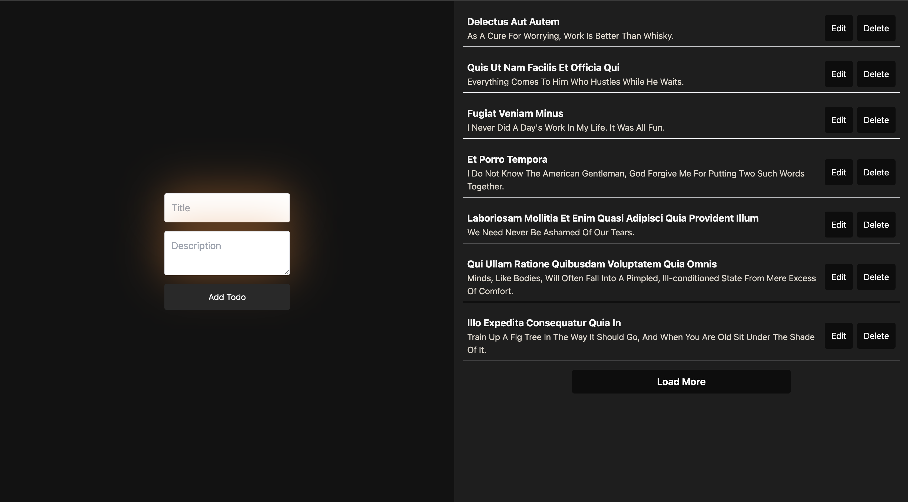

# Todo Grind

### A Minimalistic, Yet Powerful Todo App 🌟

> Built with **ReactJS**, leveraging **Tailwind CSS** for styling, and powered by **JSONPlaceholder** and **Quotable APIs** to simulate mock data.



## 🌐 [Live Demo](<https://todogrind.netlify.app/>)

---

## 📖 Overview

**Todo Grind** is a responsive, modern application designed to showcase seamless CRUD functionality. Its clean and user-friendly interface is powered by a robust **React** architecture and styled with **Tailwind CSS**.

### **Key Features:**

- ✏️ **Add, Edit, and Delete Todos** with a few clicks.
- 📜 **Dynamic Content Integration** using the **JSONPlaceholder** and **Quotable APIs**.
- 📱 **Fully Responsive Design**, optimized for **mobile** and **desktop**.
- 🚀 **Performance-optimized** React components with meaningful comments and clear structure.
- 💻 **Deployed on Netlify** for rapid access and scalability.

---

## 🛠️ **Tech Stack**

## 🛠️ Tech Stack

<div style="width: 100%; text-align: left;">
  <table style="width: 100%; border-collapse: collapse;">
    <thead>
      <tr>
        <th style="text-align: left; padding: 8px; border-bottom: 2px solid #ddd;">Category</th>
        <th style="text-align: left; padding: 8px; border-bottom: 2px solid #ddd;">Technologies</th>
      </tr>
    </thead>
    <tbody>
      <tr>
        <td style="padding: 8px; border-bottom: 1px solid #ddd;">Frontend</td>
        <td style="padding: 8px; border-bottom: 1px solid #ddd;">ReactJS, TypeScript</td>
      </tr>
      <tr>
        <td style="padding: 8px; border-bottom: 1px solid #ddd;">Styling</td>
        <td style="padding: 8px; border-bottom: 1px solid #ddd;">Tailwind CSS</td>
      </tr>
      <tr>
        <td style="padding: 8px; border-bottom: 1px solid #ddd;">API</td>
        <td style="padding: 8px; border-bottom: 1px solid #ddd;">JSONPlaceholder, Quotable API</td>
      </tr>
      <tr>
        <td style="padding: 8px; border-bottom: 1px solid #ddd;">Build Tool</td>
        <td style="padding: 8px; border-bottom: 1px solid #ddd;">Webpack</td>
      </tr>
      <tr>
        <td style="padding: 8px; border-bottom: 1px solid #ddd;">Hosting</td>
        <td style="padding: 8px; border-bottom: 1px solid #ddd;">Netlify</td>
      </tr>
    </tbody>
  </table>
</div>

---

## 🧑‍💻 **Getting Started**

Follow the steps below to run the project locally.

### **Prerequisites**

- Node.js v16 or later
- npm or yarn installed globally

### **Installation**

1. Clone the repository:
   ```bash
   git clone https://github.com/mghally999/iotech-task.git
